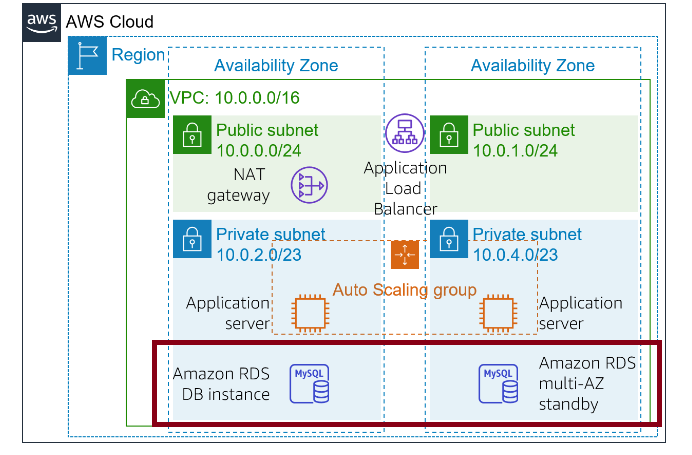
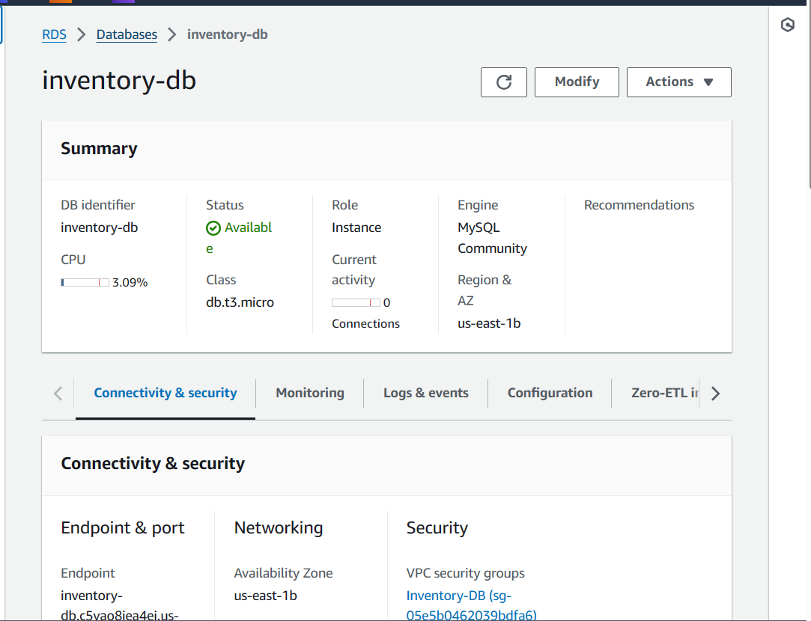
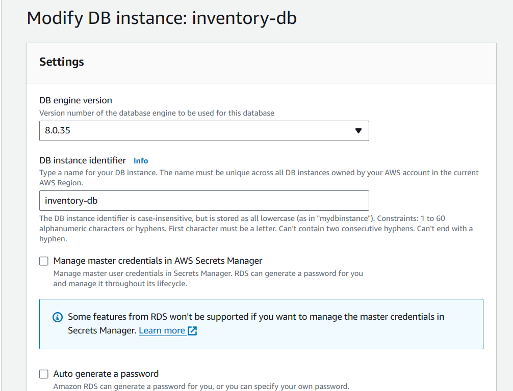
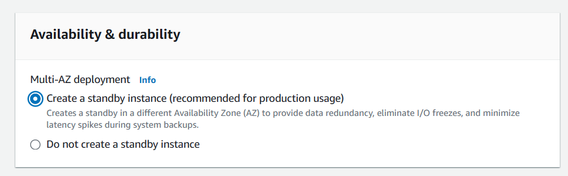
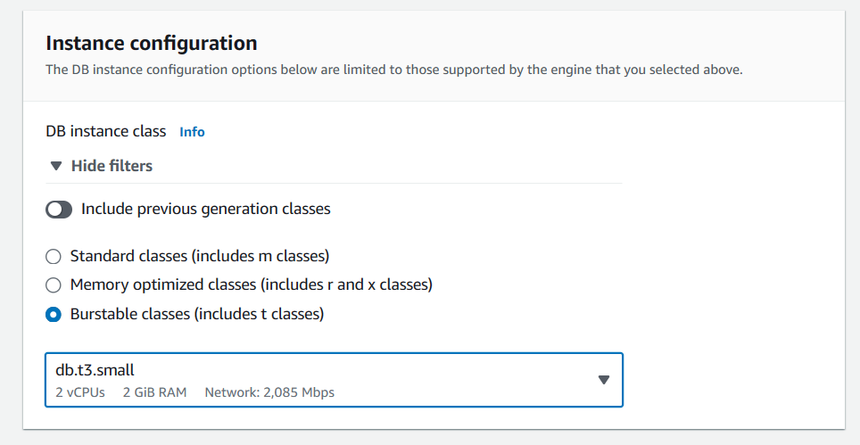
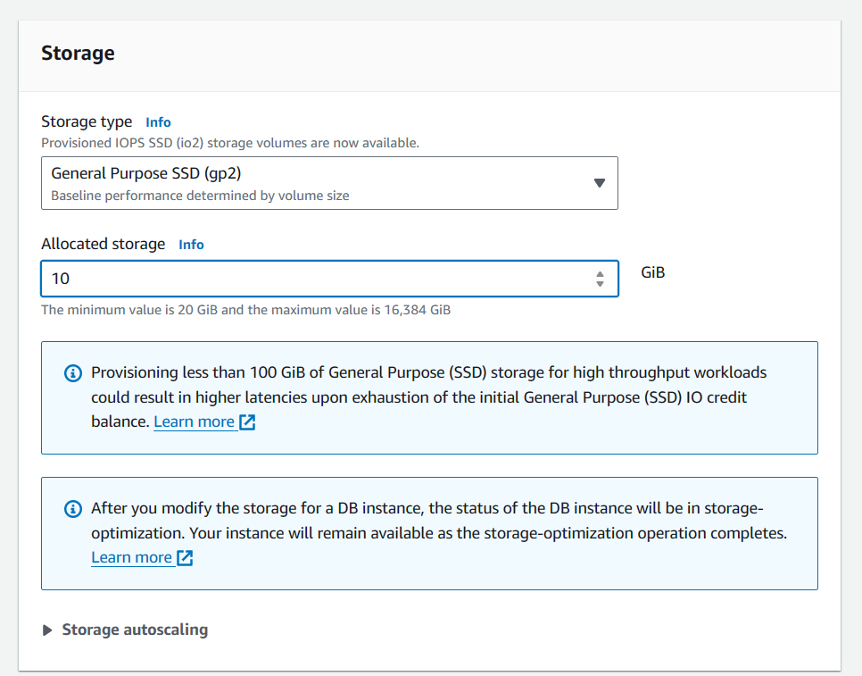
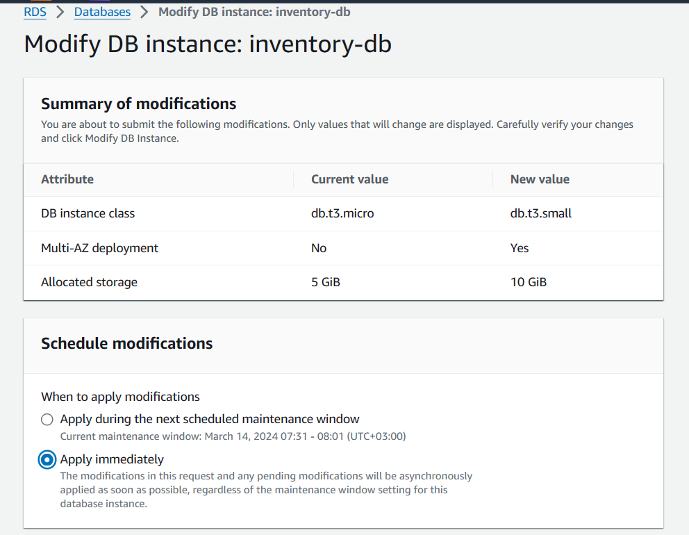

# Database High Availability (DB HA) Environment Setup 

## Introduction

* This is a continuation of [Day 3](../003/Readme.md). Initially, the Amazon RDS database operates from only one database instance. 

* I chose to continue with the topic of making databases highly available by configuring them to run across multiple Availability Zones *(Multi-AZ deployment)* because it builds upon the concept of ensuring high availability that I learned in Day 3. 

## Prerequisite

* [Day 3](../003/Readme.md) environment setup

## Use Case

* Amazon RDS databases is configured to operate in Multi-AZ deployment so as to enhance availability and fault tolerance. By replicating the database across multiple Availability Zones, any failure in one zone automatically fails over to the standby database in another zone, ensuring continuous operation and minimal downtime for applications reliant on the database.

## Try yourself

✍️ Mini-Tutorial

### Step 1 — Modify the Database

* On the Services menu, choose **RDS**.
* In the left navigation pane, choose **Databases**.
* Choose the link for the name of the **inventory-db instance**.
* Choose **Modify** 

* Scroll down to the **Availability & durability** section. For **Multi-AZ deployment**, select  C**reate a standby instance**

* Scroll back up and for **DB instance class**, select **db.t3.small.** - This doubles the size of the instance.

* For **Allocated storage** under **Storage**, enter: *10*

* On the next page, Under **Schedule modifications**, select  **Apply immediately**.

* Click **Modify DB instance** to apply changes

## ☁️ Cloud Outcome

* A deeper understanding of enhancing database availability and fault tolerance on AWS. 
* I learned the importance of Multi-AZ deployment in mitigating single points of failure and ensuring continuous operation of critical applications. 
* Additionally, I gained practical experience in configuring and testing Multi-AZ setups, equipping me with valuable skills for building resilient cloud infrastructures.

## Next Steps

* Improve the architecture by making the NAT gateway Highly Available. [Next Challenge >>](../005/Readme.md)

## Social Proof

[LinkedIn Post](https://www.linkedin.com/posts/jecinta-atieno_100daysofcloud-aws-awscloud-activity-7173782641609953280-IhsT?utm_source=share&utm_medium=member_desktop)
