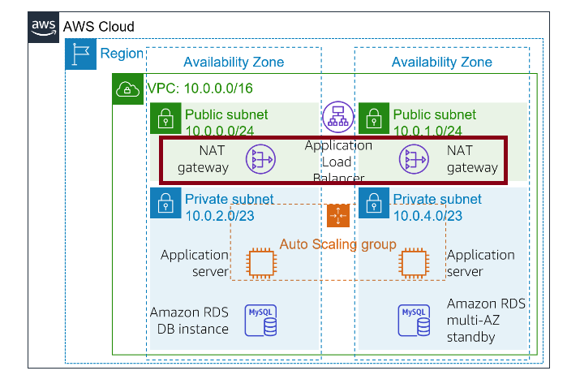
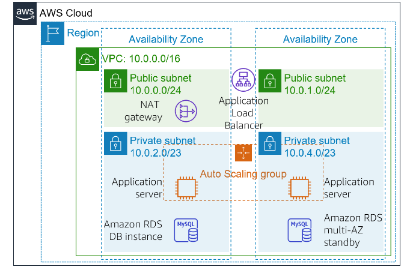
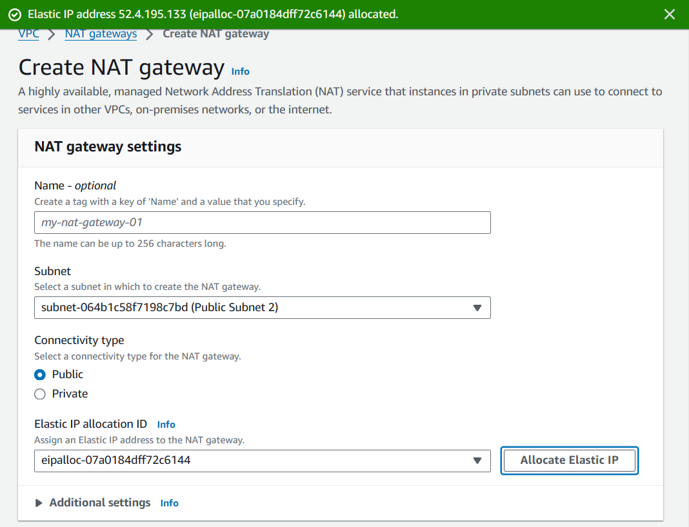
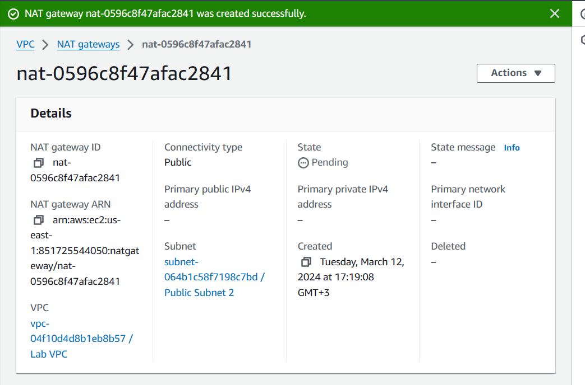
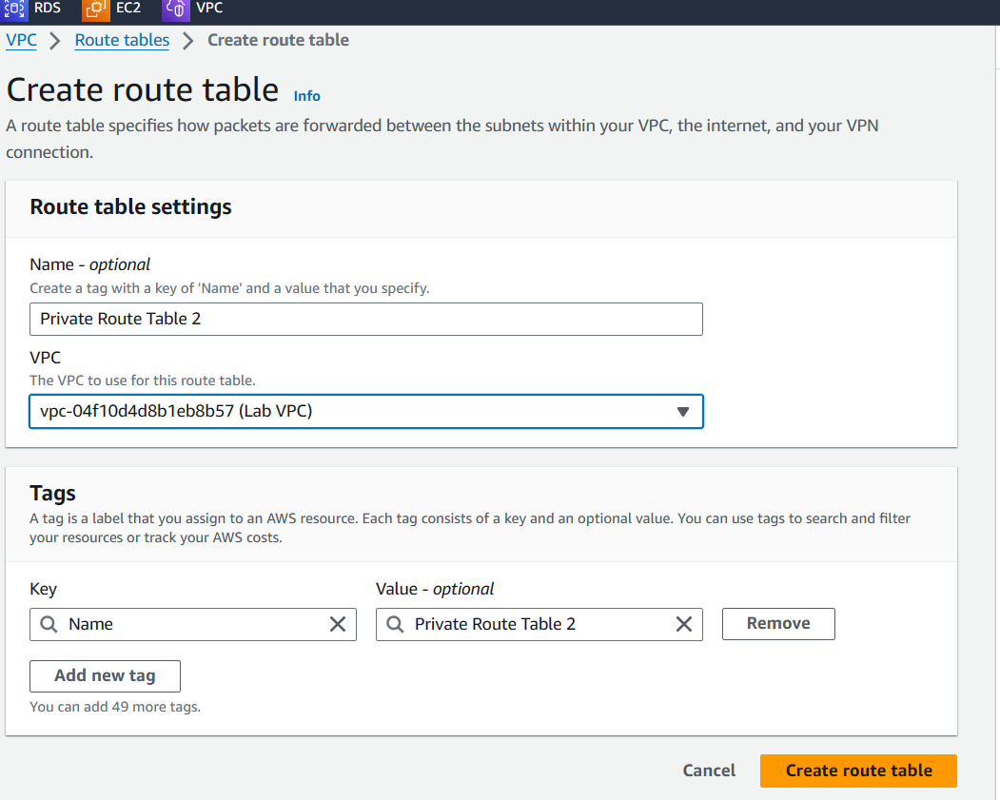
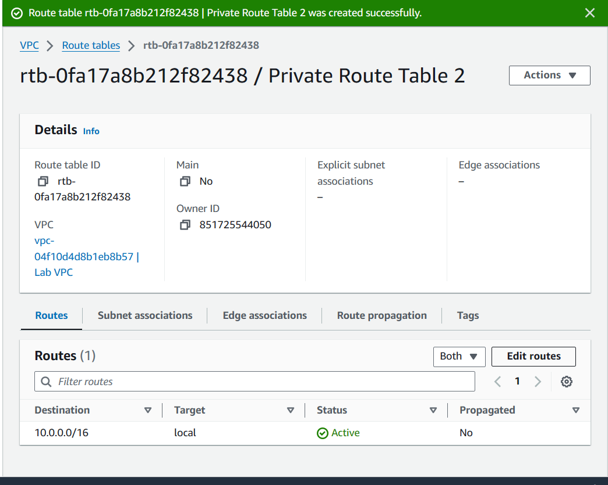
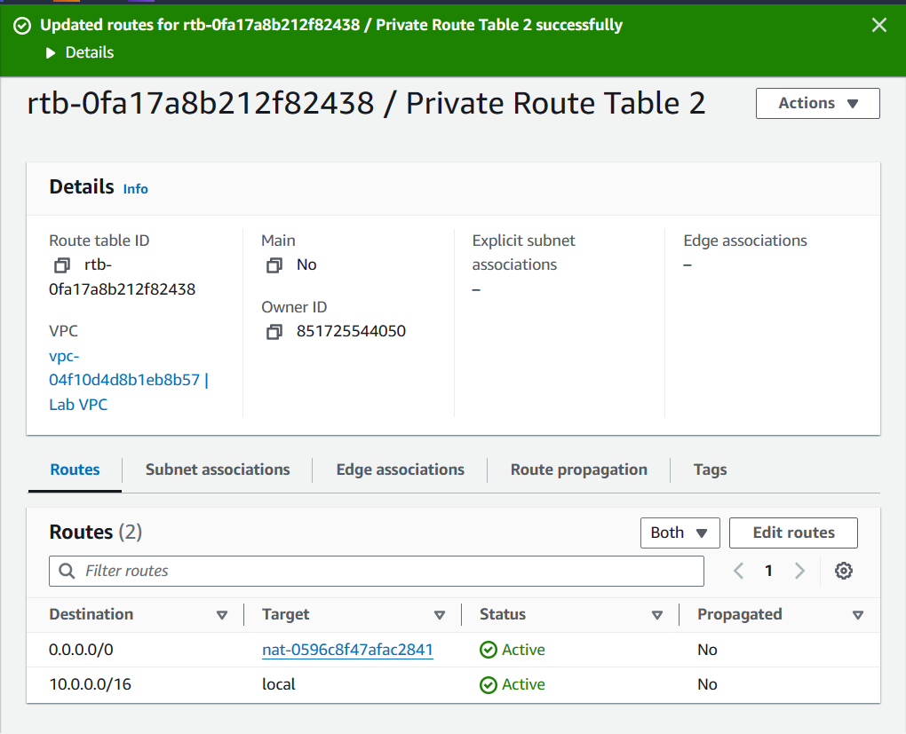
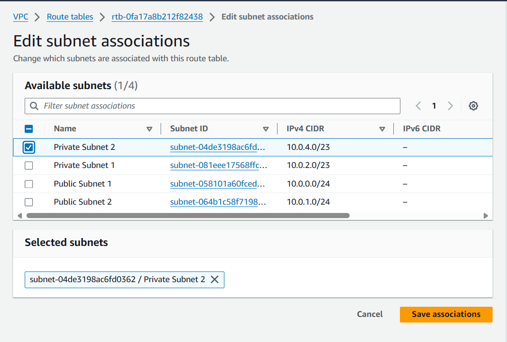

# Configuring a highly available NAT Gateway 

## Introduction

* The application servers run in a private subnet. If the servers must access the internet (for example, to download data), the requests must be redirected through a Network Address Translation (NAT) gateway. (The NAT gateway must be located in a public subnet).

* In this task, I will make the NAT gateway highly available by launching another NAT gateway in the other Availability Zone. The resulting architecture will be highly available:

## Prerequisite

* [Day 3](../003/Readme.md) Environment setup
* [Day 4](../004/Readme.md) Making the database highly available

## Use Case

* The current architecture (as shown below) has only one NAT gateway in Public Subnet 1. Thus, if Availability Zone 1 fails, the application servers will not be able to communicate with the internet.This solution demonstrates how to configure a highly available NAT gateway.

## Try yourself

✍️ Mini-Tutorial

### Step 1 — Add another NAT gateway

* On the Services menu, choose **VPC**.
* In the left navigation pane, choose **NAT gateways**.
* Choose **Create NAT gateway** and configure these settings.
    * Subnet: **Public Subnet 2**
    * Choose Allocate Elastic IP
    * Choose Create NAT gateway

* Next, you need to create *a new route table for Private Subnet 2*. This route table will redirect traffic to the new NAT gateway.
    - Choose **Route table** to create route table.

* Look at the current settings for the route table, you notice that one route directs all traffic locally. You will now add a route to send internet-bound traffic through the new NAT gateway.

* Choose **Edit routes** then configure these settings: 
    * **Destination**: `0.0.0.0/0`
    * **Target**: The newly created NAT Gateway
    * Click on **Save Changes**

* Chhose **subnet associations** tab to Edit subnet association. Select  **Private Subnet 2** then save.

Now you have a second NAT gateway with its own public IP address that can be used by resources in the private subnet in the same Availability Zone within the VPC.

Now you have a second NAT gateway with its own public IP address that can be used by resources in the private subnet in the same Availability Zone within the VPC  

## ☁️ Cloud Outcome

* A deeper understanding of enhancing fault tolerance and resilience on AWS. 
* I gained practical experience in configuring NAT gateways, equipping me with valuable skills for building resilient cloud infrastructures.

## Social Proof

[LinkedIn Post](https://www.linkedin.com/posts/jecinta-atieno_100daysofcloud-aws-awscloud-activity-7173782641609953280-IhsT?utm_source=share&utm_medium=member_desktop)
